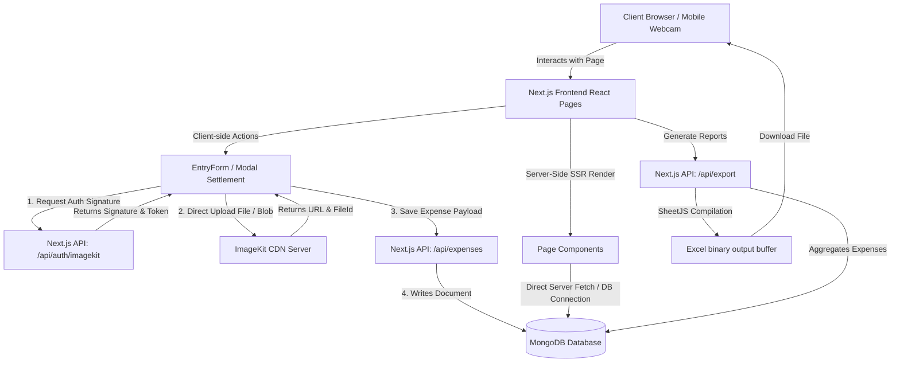
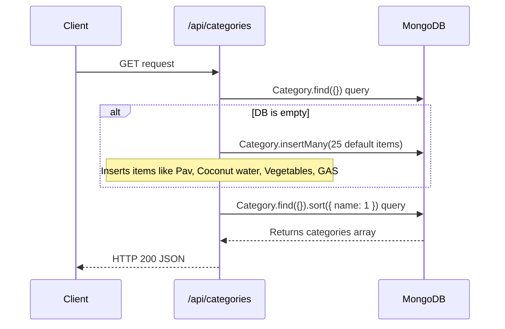
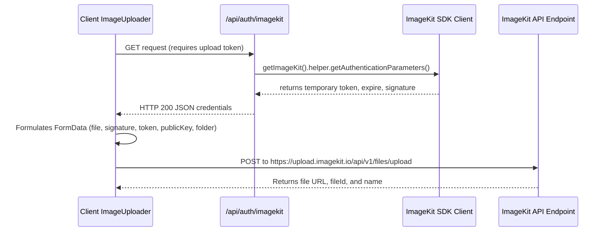
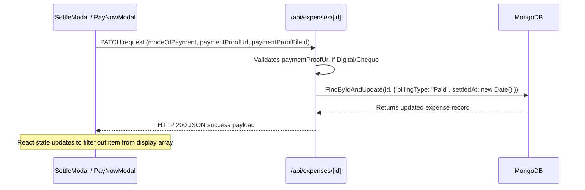

# Swad Shri Nidhi Foods — Expenditure Manager
## Production-Grade Project Documentation, Architecture, & UI/UX Logic

This document provides a comprehensive technical overview of the **Swad Shri Nidhi Foods Expenditure Manager** application. It serves as a detailed reference for developers, covering the system architecture, directory map, database schema, workflow sequences, API reference, component logic, and custom design implementation.

---

## 1. Executive Summary & Tech Stack

The **Expenditure Manager** is a dedicated finance tracker designed to streamline and record operational expenditures for *Swad Shri Nidhi Foods*. It supports capturing receipts via webcams on mobile/desktop devices, managing cash and digital payments, tracking pending invoices, organizing monthly supplier accounts, analyzing historical patterns on an activity calendar, and exporting detailed logs to spreadsheet format.

### Tech Stack Specifications
*   **Application Framework**: [Next.js 16.2.9](https://nextjs.org/) (React 19.2.4, utilizing React Server Components & App Router).
*   **Database**: [MongoDB](https://www.mongodb.com/) accessed through [Mongoose 9.7.1](https://mongoosejs.com/).
*   **Styling Engine**: [Tailwind CSS v4](https://tailwindcss.com/) with PostCSS.
*   **Image Storage & Delivery**: [ImageKit.io CDN](https://imagekit.io/) utilizing secure direct-client uploads.
*   **Form Management**: [React Hook Form 7.79.0](https://react-hook-form.com/) integrated with [Zod 4.4.3](https://zod.dev/) for deep schema validation.
*   **Spreadsheet Generation**: [SheetJS (xlsx) 0.18.5](https://sheetjs.com/) for building server-compiled Excel buffers.
*   **Visual Assets**: [Lucide React 1.20.0](https://lucide.dev/) for icon typography, `react-calendar` for event mapping, and `react-webcam` for image acquisition.

---

## 2. Architecture Overview

The system uses a decoupled, hybrid architecture leveraging Next.js App Router features:

*   **RSC (React Server Components)**: Used on landing, monthly, pending, and gallery routes to fetch data directly from MongoDB inside page components using server fetches, eliminating client-side layout shifts and loading stutters.
*   **Client Interactivity**: Specific heavy-logic blocks (forms, calendars, gallery lightboxes, confirm modals) are labeled `"use client"`.
*   **Direct-to-CDN Image Flow**: Client applications do not stream image buffers to the Next.js server. Instead, they request temporary authentication tokens from a Next.js server route, then POST media directly to ImageKit's API endpoints. This prevents high memory overheads and speeds up upload processes.
*   **Global Connection Pooling**: Database connectors are cached globally in development environments to block duplicate ports from clogging MongoDB connections during hot-reloads.

### System Diagram



---

## 3. Directory Map & Module Breakdown

The project structure is clean and separates routes from data schemas, client controls, and helpers:

```
expendturesnsf/
├── .env.local             # Local environment variables (MongoDB connection, ImageKit secrets)
├── next.config.ts         # Next.js overrides (defines remote ImageKit URL mapping constraints)
├── package.json           # Active client and server package versions
├── tsconfig.json          # TypeScript compilation settings
├── public/                # Static public assets
└── src/
    ├── app/               # App Router pages and routes
    │   ├── api/           # Backend REST API handler endpoints
    │   │   ├── auth/
    │   │   │   └── imagekit/  # Temporal signatures generator for file uploads
    │   │   ├── calendar/  # Aggregated calendar day logs
    │   │   ├── categories/# Categories resource management & default seeder
    │   │   ├── dashboard/ # Analytical card totals computation
    │   │   ├── expenses/  # REST endpoints for expense collections and operations
    │   │   ├── export/    # XLSX buffer builder using SheetJS
    │   │   ├── gallery/   # Media retrieval filter
    │   │   ├── monthly/   # Monthly billing categories aggregates
    │   │   └── pending/   # Unpaid cash/digital collections
    │   ├── calendar/      # Activity calendar route page
    │   ├── entry/         # New expense form route page
    │   ├── gallery/       # Invoice gallery route page
    │   ├── monthly/       # Monthly accounts route page
    │   ├── pending/       # Pending payments route page
    │   ├── globals.css    # Tailwind CSS v4 variables config & styling modifiers
    │   ├── layout.tsx     # Shell setup wrapping Sidebars, Drawers, and Toast controls
    │   ├── loading.tsx    # App Router loading fallback state utilizing skeletons
    │   └── page.tsx       # Main dashboard metrics page
    ├── components/        # Isolated modular client blocks
    │   ├── calendar/      # ActivityCalendar.tsx
    │   ├── dashboard/     # SummaryCards.tsx, ExportButton.tsx
    │   ├── entry/         # EntryForm.tsx
    │   ├── gallery/       # GalleryView.tsx
    │   ├── layout/        # Sidebar.tsx, TopBar.tsx (mobile layout support drawer)
    │   ├── monthly/       # MonthlyTable.tsx
    │   ├── pending/       # PendingTable.tsx
    │   └── ui/            # UI components (Modal.tsx, ImageUploader.tsx, Spinner.tsx, Skeleton.tsx)
    ├── lib/               # Shared logic libraries
    │   ├── imagekit.ts    # Instantiates node-side ImageKit client helper
    │   ├── mongodb.ts     # Global DB connection client builder
    │   └── utils.ts       # Currency formatter, Indian timezone parser, and tailwind merge
    └── models/            # Database definitions (Mongoose Schemas)
        ├── Category.ts    # List of billing categories
        └── Expense.ts     # Individual expenditure records
```

---

## 4. Database Schema Design (Mongoose Models)

### A. Category Model (`src/models/Category.ts`)
Stores the dynamic categories that organize business costs.
*   **Properties**:
    *   `_id`: Mongoose Object ID.
    *   `name` (`string`, required, unique, trimmed): e.g., `"Pav"`, `"Coconut water"`, `"Milk & CURD"`, `"GAS"`.
*   **Automatic Fields**: `createdAt`, `updatedAt` (generated via `{ timestamps: true }`).

### B. Expense Model (`src/models/Expense.ts`)
Tracks the granular details of every recorded expenditure.
*   **Properties**:
    *   `category` (`ObjectId`, ref: `"Category"`, required): Links the expense to a category document.
    *   `billNumber` (`string`, required, trimmed): Unique invoice, receipt, or reference token.
    *   `billingMonth` (`number`, required): Monthly index representation (`1` to `12`).
    *   `billingYear` (`number`, required): Year associated with the bill (e.g., `2026`).
    *   `billingType` (`string`, enum: `["Paid", "Monthly Billing"]`, required): Specifies if the expense was paid on spot or is a recurring monthly bill.
    *   `modeOfPayment` (`string`, enum: `["Cash", "Digital", "Cheque", "Pending"]`, nullable, default: `null`).
    *   `amount` (`number`, required, positive value validation): Total cost of transaction.
    *   `vendorName` (`string`, optional, trimmed): The organization or supplier.
    *   `notes` (`string`, optional, trimmed): Explanatory remarks.
    *   `billImageUrl` / `billImageFileId` (`string`, optional): Remote link and ImageKit key for receipt photo uploads.
    *   `paymentProofUrl` / `paymentProofFileId` (`string`, optional): Remote link and ImageKit key for screenshot transactions.
    *   `settledAt` (`Date`, optional, default: `null`): Set to the current time when a payment changes from outstanding to settled.
*   **Constraints & Indexes**:
    *   `Compound Unique Index`: `{ billNumber: 1, billingMonth: 1, billingYear: 1 }` prevents registering identical bill numbers in the same monthly period.
    *   `Single-Field Index`: Optimizes queries targeting:
        *   `modeOfPayment` (useful for loading pending collections: `/api/pending`).
        *   `billingType` (useful for loading recurring accounts: `/api/monthly`).
        *   `createdAt` descending (speeds up sorting on landing lists and pages).

---

## 5. System Workflows & Data Flows

### A. Dynamic Category Seeder Flow
During initial database connections, accessing the categories route automatically populates the schema if it is empty.



### B. Direct Client-to-CDN Image Upload Authorization Flow
This flow ensures image binary streams do not bottleneck the Node server.



### C. Dues Settlement Flow (Dues & Monthly Recurring Dues)
Settling a pending cash invoice or paying a monthly billing item follows this sequence:



---

## 6. Backend API Route Handlers Reference

All database interactions begin with `await connectDB()`. Below is the complete API endpoint schema:

### 1. ImageKit Gateway Signature
*   **Path**: `src/app/api/auth/imagekit/route.ts`
*   **Method**: `GET`
*   **Role**: Signs security credentials (`token`, `expire`, `signature`) via Server SDK to authenticate file uploads.

### 2. Category Controller
*   **Path**: `src/app/api/categories/route.ts`
*   **Methods**:
    *   `GET`: Pulls all categories alphabetically. Auto-seeds 25 default items on the first run if database collections are empty.
    *   `POST`: Creates a new category. Uses a case-insensitive duplicate check query:
        `Category.findOne({ name: { $regex: new RegExp("^" + name.trim() + "$", "i") } })`.
        Returns `409 Conflict` if the name is taken.

### 3. Dashboard Statistics Aggregator
*   **Path**: `src/app/api/dashboard/route.ts`
*   **Method**: `GET`
*   **Role**: Collects metrics in parallel using `Promise.all`:
    1.  Grand total of all recorded expenses and sums.
    2.  Pending dues sum and count (`modeOfPayment: "Pending"`).
    3.  Outstanding monthly accounts sum and count (`billingType: "Monthly Billing"`).
    4.  Current calendar month expenditure sum and count.

### 4. Expense Collection Handler
*   **Path**: `src/app/api/expenses/route.ts`
*   **Methods**:
    *   `GET`: Paginated expense retrieval (default `page=1`, `limit=20`) sorted by `createdAt` descending. Supports query parameters filtering for `month`, `year`, `billingType`, and `modeOfPayment`.
    *   `POST`: Inserts a new expense.
        *   Checks for billing code duplication across the month-year scope using `{ billNumber, billingMonth, billingYear }`. Returns `409` on match.
        *   Enforces payment proof validation if `billingType === "Paid"` and payment mode is digital/cheque.

### 5. Individual Expense Entity Handler
*   **Path**: `src/app/api/expenses/[id]/route.ts`
*   **Methods**:
    *   `GET`: Returns details of a specific expense, resolving category references.
    *   `PATCH`: Settle transaction. Changes status variables: sets `billingType = "Paid"`, sets `settledAt = new Date()`, updates `modeOfPayment` and payment proof URLs.
    *   `DELETE`: Deletes the specified document.

### 6. Outstanding Invoices Query
*   **Path**: `src/app/api/pending/route.ts`
*   **Method**: `GET`
*   **Role**: Returns expenses where `modeOfPayment === "Pending"`, sorted newest first.

### 7. Monthly Recurring Accounts Query
*   **Path**: `src/app/api/monthly/route.ts`
*   **Method**: `GET`
*   **Role**: Returns expenses where `billingType === "Monthly Billing"`. Returns a raw list and a `grouped` JSON payload mapped by category names for easy accordion loading.

### 8. Attachment Images Catalog
*   **Path**: `src/app/api/gallery/route.ts`
*   **Method**: `GET`
*   **Role**: Filters expenses containing either invoice images or payment confirmations:
    `{ $or: [ { billImageUrl: { $nin: [null, ""], $exists: true } }, { paymentProofUrl: { $nin: [null, ""], $exists: true } } ] }`.

### 9. Timeline Activity Aggregator
*   **Path**: `src/app/api/calendar/route.ts`
*   **Method**: `GET`
*   **Role**: Parses `createdAt` and `settledAt` timestamps into `Asia/Kolkata` date strings (`YYYY-MM-DD`). Groups events into day logs (e.g. `Expense Added` or `Payment Settled`) and calculates totals for dashboard calendar views.

### 10. Data Exporter
*   **Path**: `src/app/api/export/route.ts`
*   **Method**: `GET`
*   **Role**: Queries all expenses, builds flat table structures, converts currency to INR values, applies auto-calculated column widths (minimum width of `20` units), and streams an XLSX binary payload:
    *   `Content-Type`: `application/vnd.openxmlformats-officedocument.spreadsheetml.sheet`
    *   `Content-Disposition`: `attachment; filename="SwadShriNidhi_Expenditures_YYYY-MM-DD.xlsx"`

---

## 7. Frontend Layout, UI Components, & Control Logic

### A. Layout Structure & Core Views

1.  **Dashboard Overview (`/`)**: Server-side fetches analytic cards (`SummaryCards.tsx`) and maps quick links to core pages. Houses the `ExportButton.tsx` logic.
2.  **Expense Form (`/entry`)**: Captures form entries. Focuses on structured form fields centered inside a mobile-friendly view.
3.  **Dues Monitor (`/pending`)**: Compiles pending bills in a list layout. Clicking "Settle Payment" expands the Settle modal.
4.  **Monthly Accounts (`/monthly`)**: Collates monthly items by Category headers. Groups lists inside responsive accordions that expand and contract.
5.  **Activity Map (`/calendar`)**: Displays highlighted date cells. Selecting a day logs details in a sidebar drawer.
6.  **Gallery Viewer (`/gallery`)**: Displays receipt attachments. Users toggle between Invoice Receipts and Payment Proofs, both opening in a detailed lightbox component.

---

### B. Core Component Control Logic

#### I. EntryForm Multistep Form & Category Add (`EntryForm.tsx`)
*   **Form Controller**: Powered by React Hook Form & Zod schema. Form components watch dynamic fields (`watch("billingType")`, `watch("modeOfPayment")`) to toggle inputs and validate required fields:
    ```typescript
    const needsProof = billingType === "Paid" && (modeOfPayment === "Digital" || modeOfPayment === "Cheque");
    ```
*   **In-Place Category Insertion**: Users can create new categories without navigating away from the form. Clicking the "+" button swaps the dropdown list for a text input. Saving fires a POST request to `/api/categories`. On success, it inserts the category document into local state, sorts the list, and pre-selects the new category:
    ```typescript
    setCategories((prev) => [...prev, data].sort((a, b) => a.name.localeCompare(b.name)));
    setValue("categoryId", data._id);
    ```

#### II. Mobile Camera Integrations & Direct Uploads (`ImageUploader.tsx`)
*   **Responsive Capture**: Captures photos using desktop webcams or mobile camera interfaces:
    ```typescript
    videoConstraints={{ facingMode: "environment" }}
    ```
    This constraint defaults to the rear camera on mobile devices.
*   **Base64 to Blob Processing**: Captures screenshots as Base64 data strings using `webcamRef.current.getScreenshot()`. It converts the string to a standard binary blob to match the ImageKit API requirements:
    ```typescript
    const res = await fetch(imageSrc);
    const blob = await res.blob();
    const result = await uploadToImageKit(blob, `capture-${Date.now()}.jpg`, folder);
    ```

#### III. Localized Calendar Aggregations (`ActivityCalendar.tsx`)
*   **Event Highlights**: Uses `react-calendar` to render activities. Maps logs into a Map object keyed by date strings for efficient lookups:
    ```typescript
    const activityMap = new Map(activities.map((a) => [a.date, a]));
    ```
*   **Tile Customization**: The `tileContent` hook appends an indicator dot on active dates. The `tileClassName` hook applies custom styles to highlight days with activities:
    ```typescript
    tileClassName={({ date, view }) => view === "month" && activityMap.has(getLocalDateString(date)) ? "has-activity" : ""}
    ```

#### IV. Expandable Tables (`MonthlyTable.tsx`)
*   **State-driven Accordions**: Collates monthly accounts by categories. Expanded states are stored in a record object:
    ```typescript
    const [expandedGroups, setExpandedGroups] = useState<Record<string, boolean>>(
      Object.keys(grouped).reduce((acc, k) => ({ ...acc, [k]: true }), {})
    );
    ```
    This setup defaults all categories to expanded and allows toggling rows dynamically.

---

## 8. Styling Theme & Aesthetics (`src/app/globals.css`)

The application features a modern, clean interface styled with Tailwind CSS v4. Standard utility classes (e.g., `bg-slate-950`, `text-slate-300`, `bg-indigo-600`) are mapped to a warm, sand-themed color palette:

### Custom Theme Variable Mapping

| Tailwind Class Name | Hex Variable Value | Purpose in Application |
| :--- | :--- | :--- |
| `slate-950` | `#faf8f5` | **App Background**: Warm sand/cream background. |
| `slate-900` | `#ffffff` | **Card / Surface Background**: Pure white panels overlaying the page. |
| `slate-850` | `#f7f3ec` | **Input Fields**: Soft sand color for input backgrounds. |
| `slate-800` | `#f2ebd9` | **Interactive States**: Hover and active backgrounds. |
| `slate-700` | `#e5dccb` | **Borders**: Thin warm sand borders separating grid elements. |
| `slate-600` | `#806b5c` | **Subtext**: Soft sandy brown for descriptions. |
| `slate-505` | `#a89484` | **Placeholders**: Neutral sand color. |
| `slate-400` | `#5c1d24` | **Secondary Accent**: Deep Burgundy highlight. |
| `slate-300` | `#382c24` | **Primary Body Text**: Dark brown-sand. |
| `slate-200` | `#231913` | **Primary Headings**: Deep dark espresso color. |
| `indigo-600` | `#5c1d24` | **Primary Accent**: Deep Burgundy for brand elements and primary buttons. |
| `indigo-500` | `#b58c42` | **Status / Warning Accent**: Sand Gold for badges and highlights. |
| `indigo-400` | `#c49b55` | **Highlight Accent**: Light Sand Gold for borders and dots. |
| `emerald-600` | `#446e53` | **Paid / Settled Status**: Forest Green for completed transactions. |
| `rose-600` | `#a33843` | **Error / Negative Status**: Deep rose red. |

### Layout & Animations
*   **Page Transitions**: Uses custom CSS animations to slide pages up smoothly when loading routes:
    ```css
    @keyframes fadeIn {
      from { opacity: 0; transform: translateY(8px); }
      to { opacity: 1; transform: translateY(0); }
    }
    .page-enter {
      animation: fadeIn 0.35s cubic-bezier(0.16, 1, 0.3, 1) forwards;
    }
    ```
*   **Elevated Card Hover Effects (`.ai-card`)**:
    Provides subtle shadow and position shifts when hovering over cards:
    ```css
    .ai-card {
      background: #ffffff;
      border: 1px solid #e5dccb;
      box-shadow: 0 8px 24px -6px rgba(92, 29, 36, 0.03), 0 2px 6px -2px rgba(181, 140, 66, 0.02);
    }
    .ai-card:hover {
      border-color: #dfc293;
      transform: translateY(-1px);
      box-shadow: 0 12px 30px -8px rgba(92, 29, 36, 0.06), 0 4px 12px -3px rgba(181, 140, 66, 0.04);
    }
    ```
*   **Custom Scrollbar**: Styled to match the sand theme palette (`#faf8f5` track with `#e5dccb` thumb).
*   **Reduced Motion**: Respects browser accessibility configurations by disabling transition and animation timers if the user prefers reduced motion.

---

## 9. Local Setup & Running Instructions

### Prerequisites
*   A running **MongoDB** instance (local or Atlas cluster URL).
*   An active **ImageKit.io** account (free tier covers general requirements).

### Environment Configuration (`.env.local`)
Create a `.env.local` file in the project root:
```ini
# MongoDB Connection String
MONGODB_URI=mongodb://localhost:27017/swad-shri-nidhi-expenses

# Next.js Application Origin Url
NEXT_PUBLIC_APP_URL=http://localhost:3000

# ImageKit Credentials (Server Node SDK)
IMAGEKIT_PRIVATE_KEY=private_your_private_key...

# ImageKit Credentials (Client Side Uploader POST & Remote Patterns)
NEXT_PUBLIC_IMAGEKIT_PUBLIC_KEY=public_your_public_key...
NEXT_PUBLIC_IMAGEKIT_URL_ENDPOINT=https://ik.imagekit.io/your_imagekit_id/
```

### Installation & Run Commands
1.  Install dependencies:
    ```bash
    npm install
    ```
2.  Start the Next.js development server:
    ```bash
    npm run dev
    ```
3.  Open [http://localhost:3000](http://localhost:3000) in your browser.
4.  Build the production distribution:
    ```bash
    npm run build
    npm run start
    ```
